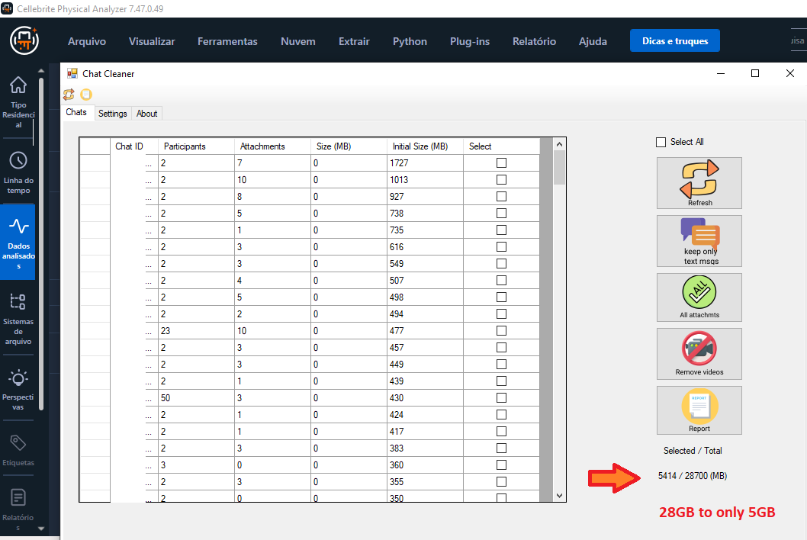
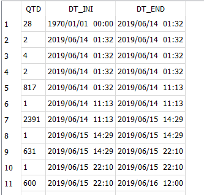
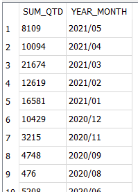

# Forensic Scripts

## Table of Contents
<details>
<summary>Cellebrite UFED Physical Analyzer</summary>

* [`Remove Attachments / Clean Chats`](#clean-chats)
</details>

<details>
<summary>WhatsApp</summary>

* [`Analyze removed messages`](#removed-messages)
* [`Find Whatsapp Key`](#find-whatsapp-key)
</details>


<hr />

## <a name="clean-chats"></a>Remove Attachments / Clean Chats

#### Motivation and Expected Results
Sometimes, chats can become extremely large and UFED PA offers no easy way to remove attachments in batch. 
Besides that, there is no way to know in advance the size of the report. 
In the following picture we show a chats extraction that amounts to 28 GB. In the middle of the image, you can see "ChatsCleaner", a tool that was made in python and that integrates with UFED PA. With ChatsCleaner aims to help the analyzer removing unwanted information in a batch command.

#### Usage
- Download chats cleaner from [Download Link](https://github.com/leosol/forensic-bites/archive/refs/heads/main.zip)
- In UFED Physical Analyzer, go to 

``Python -> Run Script -> choose main.py in ChatsCleaner``

 

## <a name="removed-messages"></a>Analyze removed messages
#### Expected results

It is exptected to have an idea of when the user might have deleted messages

 

#### Code

First image

```sql
		select 
			deleted.next_id-deleted._id as QTD, 
			deleted.dt_str as DT_INI,
			(select strftime('%Y/%m/%d  %H:%M', datetime(C.timestamp/1000, 'unixepoch')) from messages C where C._id=deleted.next_id) as DT_END
			from (
				select A._id, 
				(select min(_id) 
					from messages B 
					where B._id>A._id) as next_id,
				strftime('%Y/%m/%d  %H:%M', datetime(A.timestamp/1000, 'unixepoch')) as dt_str
			from messages A) deleted
		where deleted.next_id-deleted._id
		order by deleted.dt_str
```

Second image

```sql
select sum(QTD) as SUM_QTD, substr(DT_END,0, 8) as YEAR_MONTH
	from (
		select 
			deleted.next_id-deleted._id as QTD, 
			deleted.dt_str as DT_INI,
			(select strftime('%Y/%m/%d  %H:%M', datetime(C.timestamp/1000, 'unixepoch')) from messages C where C._id=deleted.next_id) as DT_END
			from (
				select A._id, 
				(select min(_id) 
					from messages B 
					where B._id>A._id) as next_id,
				strftime('%Y/%m/%d  %H:%M', datetime(A.timestamp/1000, 'unixepoch')) as dt_str
			from messages A) deleted
		where deleted.next_id-deleted._id
	) as final_group
group by substr(DT_END,0, 8)
order by substr(DT_END,0, 8) desc
```

## <a name="find-whatsapp-key"></a>Find Whatsapp Key

About to add some more...


